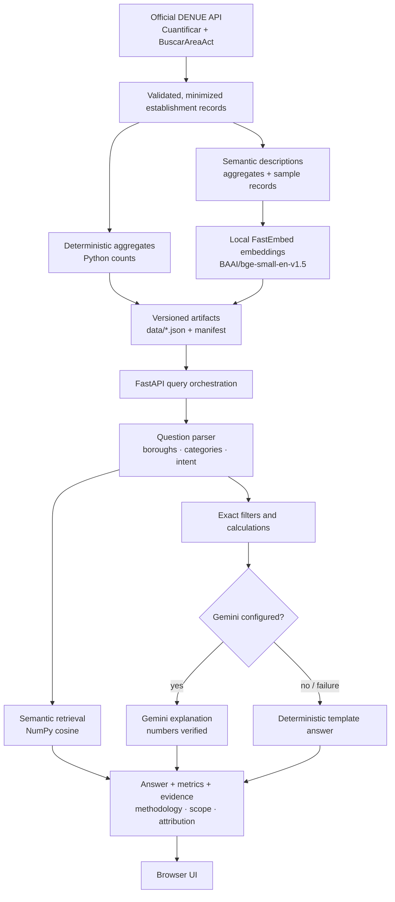

# Mexico Offline Retail Intelligence

[](https://github.com/sebagl/mexico-offline-retail-intelligence/actions/workflows/ci.yml)

Explore Mexico City's physical retail landscape using open establishment data from INEGI DENUE.

> **Fuente: INEGI, Directorio Estadístico Nacional de Unidades Económicas (DENUE), 2026-09-11.** (Date of the API retrieval that produced the committed dataset; the latest record registration date observed in the retrieved records is 2026-04. Both are stored in `data/manifest.json`.)
>
> This independent demonstration transforms and analyzes public INEGI data. The analysis was not produced, reviewed, sponsored, or endorsed by INEGI.

Built by Sebastian Gonzalez Lonzieme as a portfolio sample for a Forward Deployed Engineering role. It shows how an ambiguous idea ("help a non-technical user explore offline retail") becomes a small, production-minded application: an official open-data API, deterministic analytics, local semantic retrieval, an optional LLM explanation layer with strict guard-rails, graceful degradation, observability, tests, Docker and a free-tier deployment.

**Live demo:** <https://mexico-offline-retail-intelligence.onrender.com>

> The demo runs on a free hosting instance and may take approximately one minute to wake up after a period of inactivity.

---

## 1. Purpose

A non-technical user asks questions such as:

- Which selected borough has the most grocery stores?
- What are the most common retail categories in Benito Juárez?
- Compare the retail composition of Cuauhtémoc and Miguel Hidalgo.
- Which employment-size range is most common among pharmacies?
- Show examples of bakeries in Coyoacán.
- How many establishments are included in this dataset?

The application distinguishes four kinds of outcome and labels each answer accordingly:

| Mode | Meaning |
| --- | --- |
| `deterministic` | Exact count / percentage / ranking / comparison / distribution / examples computed in Python |
| `generated` | The same deterministic result, rephrased by Gemini (numbers verified, never recomputed) |
| `extractive` | Open question answered with the most relevant precomputed dataset facts |
| `insufficient_data` | The question is supported but the filters do not identify enough data |
| `unsupported` | Outside the dataset's scope |

**Quantitative answers are computed by Python from the normalized dataset. The language model, when enabled, is used only to explain verified results.**

## 2. Public-data source

- Product: *Directorio Estadístico Nacional de Unidades Económicas (DENUE)*, INEGI.
- Access: the documented DENUE API — <https://www.inegi.org.mx/servicios/api_denue.html>. No HTML scraping.
- Methods used: `Cuantificar` (exact totals per activity and municipality) and `BuscarAreaAct` (establishment records for one state / municipality / SCIAN class, paged with *registro inicial / final*).
- A free API token is required **only to regenerate the dataset**; the web service ships with the generated artifacts and never calls DENUE at runtime.
- Behaviour verified against the live API (not documented): a page range of 1–1000 returns all records for scopes up to at least 697 establishments; a scope with no establishments answers HTTP 200 with the JSON string `"No hay resultados. "`, which the client maps to an empty page; `Cuantificar` returns `"Total": "0"` for the same scope.

### INEGI attribution and transformation disclaimer

Both statements are shown in the header and footer of the application, in `/api/source`, in `/api/summary`, in every `/api/query` response and in this README. The INEGI logo is not used; nothing here is an official INEGI product or conclusion.

## 3. Architecture



### Data flow

1. `scripts/ingest_denue.py` reads the configured boroughs and SCIAN classes from `app/catalog.py`.
2. For each borough × class it calls `Cuantificar` (expected total) and pages through `BuscarAreaAct` until a page comes back short.
3. Records are minimized, normalized, deduplicated by DENUE `Id`, sorted deterministically and cross-checked against the expected totals.
4. Exact aggregates are computed in Python; short factual descriptions are written for every aggregate and for a bounded sample of establishments per scope, then embedded locally.
5. Four artifacts are written to a staging directory, re-validated with the runtime loader, and only then moved into `data/` (each file is replaced atomically; the manifest checksum makes a half-replaced set detectable at startup).
6. At startup the API loads the artifacts, verifies the checksum, recomputes the aggregates from the records, checks the embedding model and dimension, and loads FastEmbed once.

### Artifacts

| File | Content |
| --- | --- |
| `data/denue_establishments.json` | Minimized establishment records (compact JSON) |
| `data/denue_aggregates.json` | Exact counts by borough, category, employment stratum and their pairwise combinations |
| `data/knowledge.json` | Semantic documents (aggregate facts + sample records) with normalized embeddings |
| `data/manifest.json` | Source, URL, retrieval timestamp, latest record date observed, scope, counts, embedding metadata, schema version, SHA-256 checksum, completeness, failed scopes, expected-vs-retrieved checks, attribution, transformation notice |

## 4. Scope

### Geographic scope (configurable in `app/catalog.py`)

Ciudad de México (entidad `09`), five alcaldías: Benito Juárez (`014`), Cuauhtémoc (`015`), Miguel Hidalgo (`016`), Coyoacán (`003`), Iztapalapa (`007`). The UI states explicitly that only these boroughs are covered; nothing else in Mexico is included.

### Economic scope (SCIAN México 2023 classes)

| Category | SCIAN class(es) | Official class title |
| --- | --- | --- |
| Grocery stores | 461110 | Comercio al por menor en tiendas de abarrotes, ultramarinos y misceláneas |
| Convenience stores | 462112 | Comercio al por menor en minisupers |
| Supermarkets | 462111 | Comercio al por menor en supermercados |
| Pharmacies | 464111, 464112 | Farmacias sin minisúper / Farmacias con minisúper |
| Bakeries | 311812 | Panificación tradicional |
| Butcher shops | 461121, 461122 | Comercio al por menor de carnes rojas / de carne de aves |
| Hardware stores | 467111 | Comercio al por menor en ferreterías y tlapalerías |
| Department stores ("general retail") | 462210 | Comercio al por menor en tiendas departamentales |
| Restaurants | 722511, 722513, 722514 | Restaurantes con servicio de preparación de alimentos a la carta o de comida corrida / de antojitos / de tacos y tortas |
| Cafés | 722515 | Cafeterías, fuentes de sodas, neverías, refresquerías y similares |

Codes come from INEGI's SCIAN 2023 catalogue as exposed by the DENUE API `Clase` parameter. Where a plain-English category does not map one-to-one (bakeries are a manufacturing class; "general retail" is represented by department stores; restaurants combine three traditional service classes) the mapping is documented in `app/catalog.py`. The ingestion report flags any record whose DENUE activity label differs from the expected official title, so a wrong code cannot be published silently.

### Committed dataset snapshot (from `data/manifest.json`, retrieved 2026-09-11)

- **49,080 establishments**, 5 boroughs, 10 categories (14 SCIAN classes), 566 knowledge documents.
- Completeness: **complete** — all 70 borough × class scopes match the DENUE `Cuantificar` totals exactly; 0 records dropped, 0 duplicates, 0 activity-label mismatches.
- By borough: Iztapalapa 22,448 · Cuauhtémoc 10,511 · Coyoacán 6,264 · Benito Juárez 4,969 · Miguel Hidalgo 4,888.
- By category: grocery 14,958 · restaurants 13,789 · cafés 5,476 · butchers 5,256 · pharmacies 3,230 · hardware 2,910 · convenience 1,644 · bakeries 1,524 · supermarkets 166 · department stores 127.
- Employment size: 84.3% of establishments report 0–5 persons.

Measured: the Docker container (Linux, `--memory=512m`) sits at ~238 MiB with the dataset and the embedding model loaded and stays there under queries; on macOS the same process peaks at ~350 MB RSS. Questions answer in single-digit milliseconds without Gemini.

## 5. Data minimization

**Retained:** DENUE identifier, commercial name, economic activity class and code, employment-size range, state, borough (code and name), locality (DENUE *Colonia*, a neighbourhood-level unit — not a street address), establishment type, record registration/update date (`Fecha_Alta`).

**Excluded:** telephone, e-mail, website, legal entity name (`Razon_social`), street type, street, exterior/interior number, postal code, the full `Ubicacion` string, AGEB/block codes and **coordinates** (a 10 cm geocode plus a name is a more precise locator than an address, and nothing in the product needs it). `EstablishmentRecord` uses `extra="forbid"`, so a record carrying any other key fails validation at startup.

Establishment names appear only in `examples` answers and in the bounded sample used for semantic retrieval; the primary experience is aggregated statistics.

## 6. Deterministic calculations

`app/services/analytics.py` contains the only arithmetic in the system: counts, percentages (one decimal), rankings with alphabetical tie-breaks, borough comparisons, employment-size distributions and deterministic examples (sorted by name, then id). All results are attached to the API response as `metrics` so a reviewer can verify every number.

## 7. Semantic retrieval

- Model: `BAAI/bge-small-en-v1.5` via FastEmbed (ONNX Runtime, CPU, no API key, no PyTorch/Transformers), loaded once per process during both ingestion and serving.
- Documents: one per borough, per category, per borough × category (with the most common employment range), one dataset overview, plus up to 10 sample establishments per borough × category.
- Vectors are L2-normalized; scoring is a single NumPy matrix product; near-duplicates are removed; results are filtered to the boroughs/categories mentioned in the question.
- Retrieval supplies *supporting evidence* shown with deterministic answers and drives the `extractive` mode for open questions. Because bge-small scores unrelated text only slightly below relevant text, `extractive` additionally requires an anchor: a recognised borough/category in the question, or an aggregate document as the top hit. Numbers inside evidence documents were themselves computed by Python during ingestion.
- The embedding model is English-oriented; Spanish questions reach the same documents because the retrieval query is augmented with the canonical English names of the boroughs/categories the parser recognised (`¿Cuántas panaderías hay en Coyoacán?` → `… (Coyoacán, Bakeries)`). A multilingual model would be the next step for free-form Spanish.

## 8. Optional Gemini explanation

Set `GEMINI_API_KEY` and `GEMINI_MODEL` (no model is hard-coded). Optionally set `GEMINI_THINKING_BUDGET=0` to disable "thinking" on models that support it: the call only rephrases pre-computed numbers, so thinking adds seconds of latency and nothing else. Gemini receives a JSON payload with the intent, filters, calculated metrics, the deterministic answer and the dataset scope, plus the retrieved evidence, and is instructed:

> Use only the supplied structured analysis and retrieved evidence. Every numeric value has already been calculated by the application and must be reproduced exactly. Do not calculate, estimate, correct, or replace any value. Do not use outside knowledge.

Guard-rails (`explanation_problem` in `app/services/query.py`): Gemini is only called for supported, sufficient questions; the prompt carries the structured analysis and the question in a delimited "data, not instructions" block — retrieved evidence and establishment names are *not* sent; the reply is discarded (and the deterministic answer used) if it contains a number — in digits or in words — that is not a calculated value or a known context value (scope sizes, retrieval year), omits the headline value, uses unverifiable fractions ("over half"), contains a URL/domain or an endorsement claim, or exceeds 900 characters; timeouts, rate limits, quota exhaustion, invalid credentials, unavailable models, malformed and empty responses all fall back. Discards are logged with a reason and surface in `/health` as `degraded` with `generation_last_failure`. Verified explanations are cached per question for the life of the process (the dataset is immutable), so repeated questions cost no quota. Token usage is logged per call. Note that the Gemini free tier has a low requests-per-minute quota: rapid successive questions fall back to exact answers until the window resets. The key never leaves the backend and is never logged.

## 9. Local fallback

Without Gemini every answer is produced from templates and calculated values (`deterministic`), from retrieved facts (`extractive`), or as a clear `insufficient_data` / `unsupported` message. Retrieval, citations, scope and attribution work identically in both cases. No paid API is required.

## 10. DENUE token configuration

1. Register for a free token at <https://www.inegi.org.mx/servicios/api_denue.html>.
2. Copy `.env.example` to `.env` and set `INEGI_API_TOKEN=<your token>`.
3. Never commit `.env`. The token is only read by `scripts/ingest_denue.py`; the web service does not need it.

Without a token the ingestion command prints a setup error and exits with code 2; the application still starts with the committed dataset.

## 11. Ingestion (regenerating the dataset)

```bash
python -m scripts.ingest_denue
```

What it does: validates the token; iterates the configured boroughs × SCIAN classes; calls only documented endpoints with HTTPX (timeouts, three retries with back-off, 0.3 s spacing between requests); validates every response; normalizes text and identifiers; removes contact fields; deduplicates by `Id`; orders deterministically; computes aggregates; writes semantic descriptions; embeds locally; builds the manifest (including the SHA-256 of the records file); writes everything atomically through a staging directory that is re-validated before replacing the previous dataset; prints a report with expected-vs-retrieved counts per scope.

If any scope fails or its count differs from `Cuantificar`, the manifest is marked `complete: false`, the failed scopes are listed, the report says so, exit code is 3, and every answer carries `basis: partial_dataset`. A partial dataset is never described as comprehensive.

## 12. Local development

```bash
python3.12 -m venv .venv
source .venv/bin/activate
pip install -r requirements-dev.txt   # runtime deps are pinned in requirements.txt
cp .env.example .env            # optionally add INEGI_API_TOKEN / GEMINI_* values
python -m scripts.ingest_denue  # only if you want to regenerate data/ (needs INEGI_API_TOKEN)
uvicorn app.main:app --port 8000 --workers 1
```

Open <http://localhost:8000>. Endpoints:

| Endpoint | Purpose |
| --- | --- |
| `GET /` | Web application |
| `GET /health` | `ok` (dataset loaded; Gemini optional), `degraded` (configured Gemini failed recently — `generation_last_failure` names the category, e.g. `rate_limited` or `explanation_foreign_number`), `unavailable` (HTTP 503, dataset not loaded); dataset counts, completeness, embedding model, Gemini configured, fallback availability |
| `GET /api/source` | Source name/URL, attribution, retrieval date, latest record date, scope, completeness, failed scopes, transformation notice |
| `GET /api/summary` | Aggregate counts for the dashboard |
| `POST /api/query` | `{"question": "..."}` → answer, mode, intent, metrics, filters, evidence, source, scope, methodology, attribution |

Errors use `{"error": {"code": "...", "message": "..."}}` with 400 (invalid normalized question), 413 (body too large), 422 (schema), 429 (rate limit), 503 (dataset unavailable) and 500 only for unexpected failures — never with a stack trace, always with the request ID and security headers. The interactive API docs are disabled (they need CDN scripts the CSP blocks).

## 13. Tests

```bash
pytest -q
ruff format --check . && ruff check .
```

Tests (`pytest -q`, ~1 s) run offline with a **synthetic** dataset (`TEST ESTABLISHMENT …` names, clearly not real DENUE records), a keyword-based fake embedder and a mocked Gemini client. They cover DENUE normalization and field removal, deduplication, aggregate/percentage/ranking/comparison maths, borough and category aliases (accent-insensitive, Spanish and English), intents, unsupported questions, truncated/partial ingestion, manifest and checksum validation, attribution presence, retrieval, Gemini failure categories, the numeric-consistency guard, deterministic fallback, every endpoint, health transitions, rate limiting, controlled errors, the faithfulness guard rule by rule, employment-size filters across every intent, staged-write rollback, and a repository sweep that fails if any hostname outside an allowlist, private contact field or unsafe DOM sink appears. CI runs lint + tests and then builds the Docker image and boots it against `/health`.

## 14. Evaluation

```bash
python -m scripts.evaluate
```

A smoke test, not a benchmark: it runs the suggested questions plus a set of paraphrases (English and Spanish, filtered by employment size, joined boroughs, off-topic and injection-style inputs) against the generated dataset without Gemini and checks borough/category/intent detection, exact values recomputed from the records, and rejection of off-topic questions, reporting evidence scores and latency. The parser vocabulary was tuned on questions of this kind, so passing it shows the shipped behaviour, not general analytical accuracy. The Gemini path is covered by unit tests with a mocked client (failure categories and the faithfulness guard), not by this script.

## 15. Docker

```bash
docker build -t mexico-offline-retail-intelligence .
docker run --rm -p 8000:8000 mexico-offline-retail-intelligence
# with Gemini:
docker run --rm -p 8000:8000 -e GEMINI_API_KEY=... -e GEMINI_MODEL=... mexico-offline-retail-intelligence
curl http://localhost:8000/health
```

The image is `python:3.12-slim` (digest-pinned), installs only the pinned runtime dependencies before copying code, downloads the embedding model at build time, copies the four validated artifacts, runs as a non-root user, exposes a Python-based `HEALTHCHECK`, respects `PORT` and runs exactly one Uvicorn worker.

## 16. Render deployment

1. Push the repository to GitHub.
2. Sign in to Render and create a **Blueprint** from the repository (`render.yaml` defines the service `mexico-offline-retail-intelligence`, Docker runtime, Free plan, health check `/health`).
3. Optionally set `GEMINI_API_KEY` and `GEMINI_MODEL` in the dashboard (`sync: false`). Leave them blank for deterministic-only operation.
4. Deploy and open the public URL.

`INEGI_API_TOKEN` is **not** configured on Render: the data ships in the image, there is no ingestion endpoint, and regeneration is a deliberate local step followed by a new commit.

### Free-tier limitations

512 MB RAM and 0.1 CPU; the service sleeps after inactivity and the first request afterwards is slow; the filesystem is ephemeral (the project never writes at runtime). Open the demo before an interview.

## 17. Security

- Secrets stay on the backend; nothing sensitive is logged (request IDs and question lengths only).
- Input validation: non-empty normalized question, configurable maximum length, `extra="forbid"`, 16 KB body limit.
- Process-local sliding-window rate limiter per client IP. With `TRUST_PROXY_HEADERS=true` (Render) the right-most `X-Forwarded-For` entry is used after validation as an IP address, assuming one trusted proxy hop; malformed headers fall back to the socket peer. Resets on restart; not sufficient for horizontal scaling.
- Configurable CORS, security headers and a strict Content-Security-Policy; server-generated request IDs.
- Safe rendering: the frontend uses `textContent` only; the only external link is the INEGI documentation page.
- Prompt injection: the model only ever sees the calculated payload and the question inside a delimited block; retrieved text never reaches the prompt; the faithfulness guard rejects replies that change or add numbers, spell numbers out, contain URLs or claim endorsement. This bounds what a hostile question can make the UI display under the "explained by Gemini" label.
- No conversation storage, no ingestion endpoint, no arbitrary URL fetching.

## 18. Dataset completeness

`/api/source` reports `complete`, `completeness_note` and `failed_scopes`; every `/api/query` response reports `scope.basis` as `complete_configured_dataset`, `filtered_subset` or `partial_dataset`. Expected-vs-retrieved counts per scope are stored in the manifest (`count_checks`).

## 19. Known limitations

Snapshot data (no scheduled refresh); five boroughs and ten categories; rule-based question parsing (English/Spanish keywords, no free-form reasoning); English-oriented embedding model; a bounded sample of establishment descriptions is embedded, not every record; process-local rate limiting; in-memory retrieval; no authentication; no feedback loop; Gemini free-tier quotas; Render cold starts.

## 20. Production evolution

PostgreSQL + pgvector for records and vectors; scheduled incremental DENUE refresh with change tracking; queue-based ingestion; authentication, authorization and multi-tenant isolation; Redis rate limiting behind an API gateway; dataset and prompt versioning; distributed tracing and retrieval metrics; feedback capture, automated evaluations and human review; a secret manager; horizontal scaling.

---

*This project was designed and implemented by Sebastian Gonzalez Lonzieme as a focused technical demonstration. AI-assisted development tools were used as part of the development workflow, while architectural decisions, scope, validation, and final code ownership remained with the author.*
